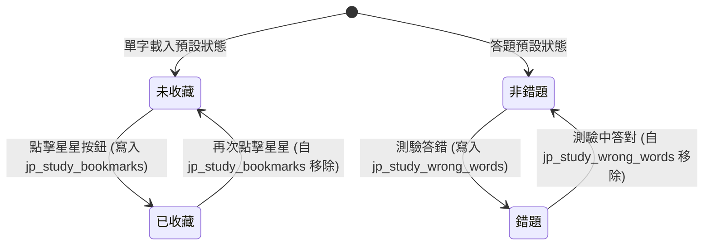

# Data Model: 日語學習工具 (Japanese Learning Tool)

本文件定義日語學習工具的資料實體模型與瀏覽器本機儲存（localStorage）的資料結構。

## 1. 核心資料結構 (In-Memory Entities)

### VocabularyItem (單字實體)
代表從 [vocabulary_list.md](file:///c:/sourceTree/japanese_study/specs/vocabulary_list.md) 解析出的單字條目。

```typescript
interface VocabularyItem {
  id: string;            // 唯一識別碼，格式如 "L13_core_0" 或以單字+讀音之雜湊值
  lesson: string;        // 課別 (例如 "第 13 課")
  section: string;       // 區塊 (例如 "核心單字" 或 "會話與相關單字")
  word: string;          // 日文單字漢字或假名 (例如 "遊びます")
  reading: string;       // 平假名/片假名讀音 (例如 "あそびます")
  translation: string;   // 中文翻譯 (例如 "玩、遊玩")
  notes: string;         // 註解或搭配詞 (例如 "[公園を~] 在公園散步")
  isBookmarked: boolean; // 是否已收藏（動態關聯自 LocalStorage）
  isWrong: boolean;      // 是否在錯題本中（動態關聯自 LocalStorage）
}
```

---

## 2. 本地持久化結構 (LocalStorage Schema)

為了在瀏覽器重新整理或關閉後保留使用者的收藏與錯題紀錄，系統使用瀏覽器 `localStorage` 進行持久化。

### Key: `jp_study_bookmarks`
*   **用途：** 儲存所有被標記星星書籤的單字 ID。
*   **格式：** JSON Array of Strings
*   **範例：**
    ```json
    [
      "遊びます_あそびます",
      "疲れます_つかれます"
    ]
    ```

### Key: `jp_study_wrong_words`
*   **用途：** 儲存所有在測驗中答錯的單字 ID，用於錯題本功能。
*   **格式：** JSON Array of Strings
*   **範例：**
    ```json
    [
      "結婚します_けっこんします"
    ]
    ```

---

## 3. 狀態移轉與邏輯 (State Transitions)



### 規則說明
1.  **書籤與錯題獨立運作**：單字可以同時被收藏且是錯題，兩者狀態互不干涉。
2.  **錯題自動移出機制**：在任何測驗模式中，若該題目屬於錯題本中的單字，且使用者順利答對，系統必須立即將該單字 ID 自 `jp_study_wrong_words` 中移除。
