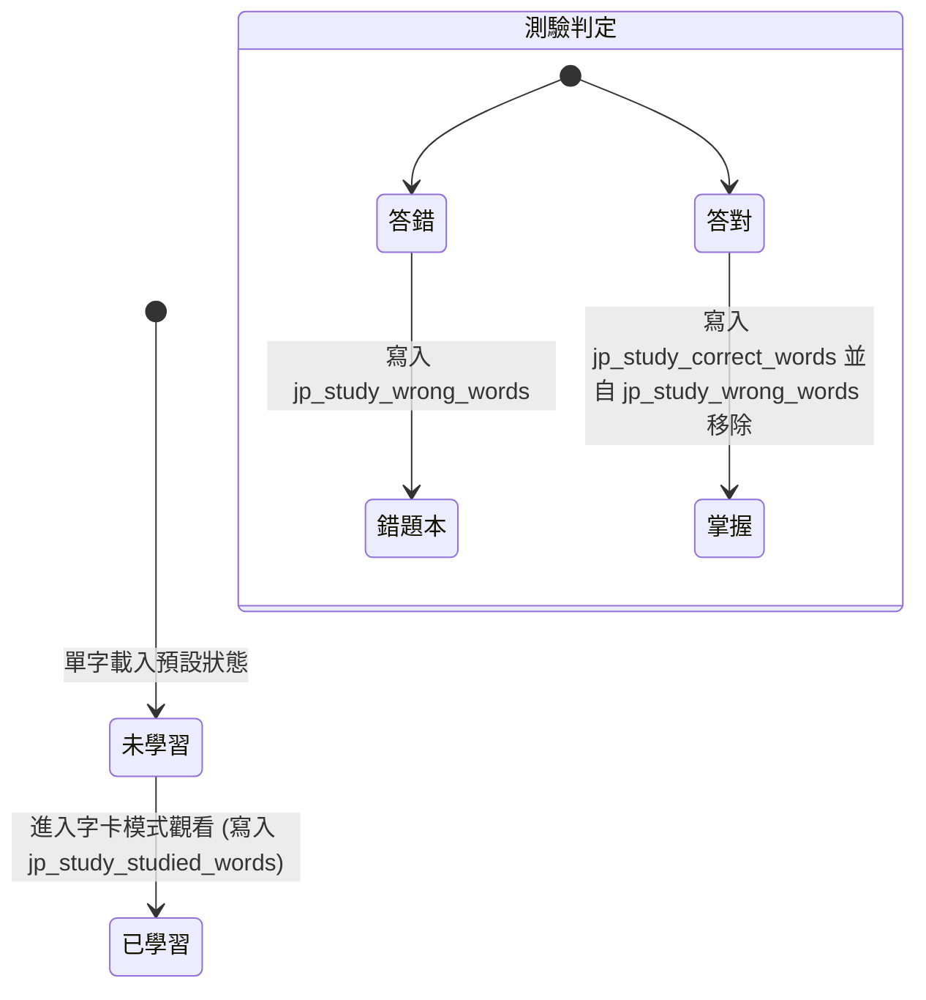

# 資料實體模型規格書 (Data Model Specification)

本文件定義本專案所有的記憶體中資料結構（In-Memory Entities）以及瀏覽器本地儲存（LocalStorage）資料結構。

---

## 1. 記憶體中實體模型 (In-Memory Entities)

### A. VocabularyItem (單字實體)
代表從 [vocabulary_list.md](file:///c:/sourceTree/japanese_study/specs/vocabulary_list.md) 中解析出的單字資料。

```typescript
interface VocabularyItem {
  id: string;            // 唯一識別碼，格式如 "單字_讀音" (例如 "遊びます_あそびます")
  lesson: string;        // 課別 (例如 "第 13 課")
  section: string;       // 區塊 (例如 "核心單字" 或 "會話與相關單字")
  word: string;          // 日文單字漢字或假名 (例如 "遊びます")
  reading: string;       // 平假名/片假名讀音 (例如 "あそびます")
  translation: string;   // 中文翻譯 (例如 "玩、遊玩")
  pos: string;           // 詞性標籤 (例如 "1類動詞"、"な形容詞"、"名詞"、"副詞"、"短句")
  dictionaryForm: string; // 動詞原形/辭書形 (例如 "遊報"，非動詞則為空字串 "")
  notes: string;         // 註解或搭配詞 (例如 "[公園を~] 在公園散步")
  isBookmarked: boolean; // 是否已收藏（動態同步自 LocalStorage）
  isWrong: boolean;      // 是否在錯題本中（動態同步自 LocalStorage）
}
```

### B. VerbConjugationItem (動詞活用實體)
代表從 [verb_conjugation_list.md](file:///c:/sourceTree/japanese_study/specs/verb_conjugation_list.md) 中解析出的動詞活用結構。

```typescript
interface VerbConjugationItem {
  id: string;            // 唯一識別碼，格式如 "ます形_讀音" (例如 "遊びます_あそびます")
  masuForm: string;      // 動詞ます形 (例如 "遊びます")
  reading: string;       // ます形平假名讀音 (例如 "あそびます")
  teForm: string;        // て形 (例如 "あそんで")
  dictForm: string;      // 字典形/原形 (例如 "あそぶ")
  naiForm: string;       // ない形 (例如 "あそばない")
  taForm: string;        // た形 (例如 "あそんだ")
  translation: string;   // 中文翻譯 (例如 "玩")
  lesson: string;        // 出現課別 (例如 "13")
  verbClass: string;     // 動詞分類 ("1類動詞" | "2類動詞" | "3類動詞")
  isBookmarked: boolean; // 是否已收藏（動態同步自 LocalStorage）
}
```

---

## 2. 本地儲存結構 (LocalStorage Schema)

為了在重新整理或離線時保留學習紀錄，系統在瀏覽器 `localStorage` 中維護以下結構。

### A. 星星書籤 (Bookmarks)
*   **LocalStorage Key**：`jp_study_bookmarks`
*   **用途**：儲存所有被加星號收藏的單字/動詞 ID。
*   **格式**：JSON Array of Strings
*   **範例**：
    ```json
    [
      "遊びます_あそびます",
      "疲れます_つかれます"
    ]
    ```

### B. 智慧錯題本 (Wrong Words)
*   **LocalStorage Key**：`jp_study_wrong_words`
*   **用途**：儲存所有在測驗中答錯的單字 ID。
*   **格式**：JSON Array of Strings
*   **範例**：
    ```json
    [
      "結婚します_けっこんします"
    ]
    ```

### C. 進度追蹤相關 Key (學習進度功能設計)
*   **儲存已學習單字** (`jp_study_studied_words`)
    *   **用途**：記錄在「字卡模式」看過的單字 ID（用於計算各課學習進度百分比）。
    *   **格式**：JSON Array of Strings (例如 `["遊びます_あそびます"]`)
*   **儲存已答對單字** (`jp_study_correct_words`)
    *   **用途**：記錄在「測驗模式」答對過的單字 ID（用於計算各課測驗掌握度）。
    *   **格式**：JSON Array of Strings
*   **每日統計日誌** (`jp_study_progress_logs`)
    *   **用途**：按日儲存學習計量（看卡數、測驗答題數、正確率），用於繪製 7 日趨勢柱狀圖。
    *   **格式**：JSON Array of Objects
        ```typescript
        Array<{
          date: string;                  // "YYYY-MM-DD"
          vocabStudyCount: number;       // 看過單字卡數
          vocabQuizTotal: number;        // 單字測驗回答題數
          vocabQuizCorrect: number;      // 單字測驗答對題數
          verbStudyCount: number;        // 看過動詞卡數
          verbQuizTotal: number;         // 動詞測驗回答題數
          verbQuizCorrect: number;       // 動詞測驗答對題數
        }>
        ```
*   **連續天數統計** (`jp_study_streak_stats`)
    *   **用途**：紀錄火焰勳章所需的連續天數狀態。
    *   **格式**：JSON Object
        ```json
        {
          "currentStreak": 3,
          "longestStreak": 14,
          "lastActiveDate": "2026-06-30"
        }
        ```

---

## 3. 狀態移轉與邏輯 (State Transitions)



### 規則與同步機制
1.  **書籤與錯題獨立**：單字可以同時在書籤與錯題本中，兩者狀態互不干涉。
2.  **錯題自動更新**：在任何測驗中若答對了先前存在於錯題本 (`jp_study_wrong_words`) 中的單字，系統應立即將其移出，同時將該單字 ID 寫入 `jp_study_correct_words`（標記為掌握）。
3.  **進度重置**：使用者在進度面板點選「清除統計」時，系統會清空 `jp_study_studied_words`、`jp_study_correct_words`、`jp_study_progress_logs` 與 `jp_study_streak_stats`。
