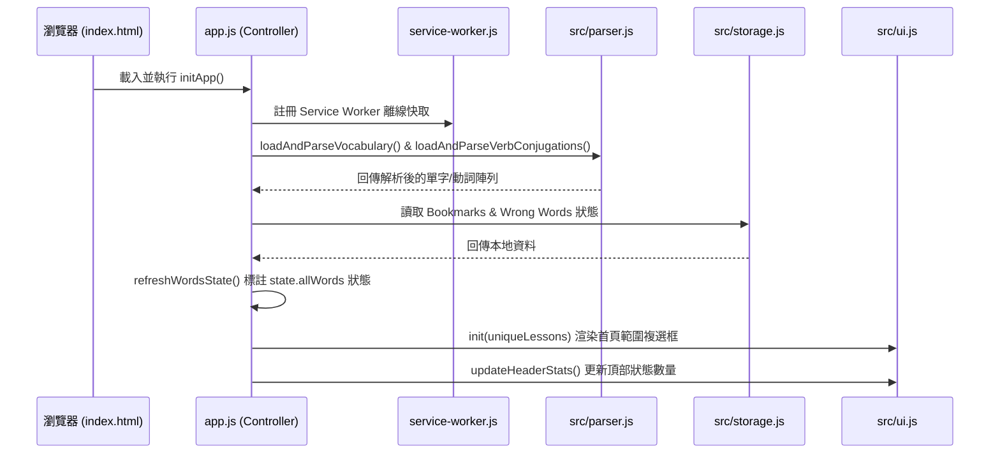
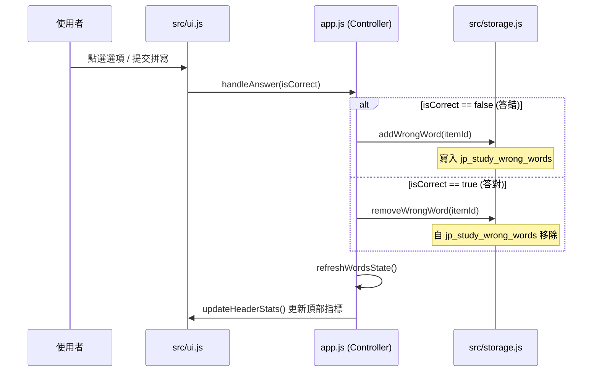
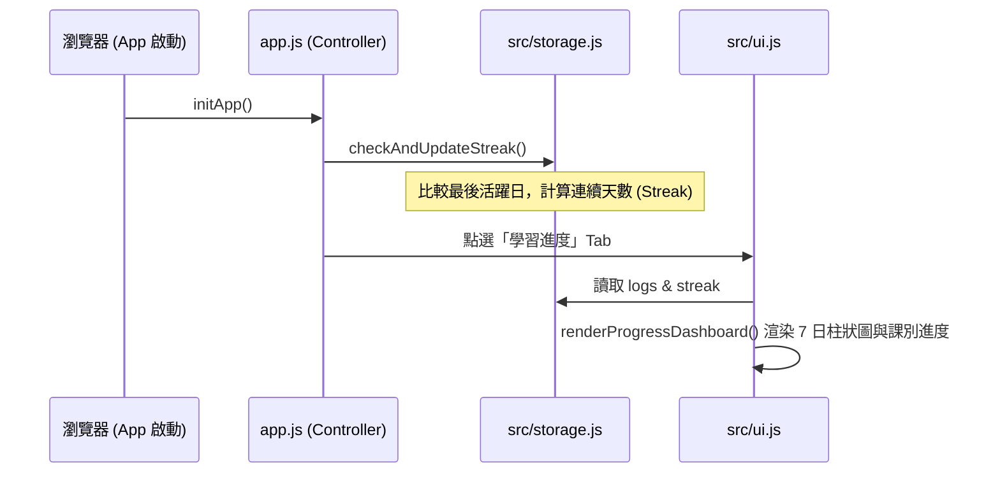

# 系統架構說明書 (System Architecture Specification)

本文件說明本專案的系統設計架構、模組職責分工、狀態流轉與持久化機制，供後續開發與維護查閱。

---

## 1. 架構概述 (High-Level Architecture)

本專案採用 **純前端無伺服器 (Serverless SPA)** 架構，所有單字與動詞資料庫皆存放在 Markdown 文件中，在網頁載入時動態發送請求取得並解析。系統核心邏輯完全運行於瀏覽器沙盒內，利用 `localStorage` 持久化使用者學習資料，並使用 `Service Worker` 實現完整的離線存取功能。

```mermaid
graph TD
    subgraph Browser Client (單頁應用)
        app[app.js - 全局協調與狀態]
        ui[src/ui.js - 介面渲染與事件]
        storage[src/storage.js - 本地持久化]
        
        subgraph Business Logic (業務邏輯與解析)
            parser[src/parser.js]
            verb_parser[src/verb_parser.js]
            quiz[src/quiz.js]
            verb_quiz[src/verb_quiz.js]
        end
    end
    
    subgraph Data Sources & Assets
        vocab_db[(specs/vocabulary_list.md)]
        verb_db[(specs/verb_conjugation_list.md)]
        sw[service-worker.js]
    end
    
    %% Interactions
    app -->|載入| vocab_db
    app -->|載入| verb_db
    app -->|引導與路由| ui
    ui -->|調用| storage
    app -->|資料解析| parser
    app -->|資料解析| verb_parser
    ui -->|題目生成/驗證| quiz
    ui -->|動詞驗證| verb_quiz
    sw -.->|背景離線代理| Browser
```

---

## 2. 核心模組職責說明 (Module Responsibilities)

| 檔案路徑 | 職責 | 說明 |
| :--- | :--- | :--- |
| `app.js` | **應用程式主控與狀態機** | 定義全局狀態 `State`，初始化應用、協調分頁與導覽 Tab 切換、並在載入時更新連續登入天數。 |
| `src/parser.js` | **單字解析器** | 以 AJAX 異步請求 `vocabulary_list.md`，將 Markdown 表量資料轉換為 `VocabularyItem` 物件陣列。 |
| `src/verb_parser.js` | **動詞解析器** | 以 AJAX 異步請求 `verb_conjugation_list.md`，解析動詞活用表格，轉換為動詞物件陣列。 |
| `src/storage.js` | **資料持久化封裝層** | 直接封裝 `localStorage`，處理星星書籤、錯題本、已學習與答對進度、連續天數及每日活動日誌的讀取、寫入與計算。 |
| `src/quiz.js` | **單字測驗引擎** | 包含過濾測驗範圍、生成不重複的 4 個隨機選項、寬鬆判定輸入假名（忽略空格、半形符號等）與首字提示演算法。 |
| `src/verb_quiz.js` | **動詞活用測驗引擎** | 包含動詞範圍過濾、同類動詞干擾選項生成、以及活用拼寫判定演算法。 |
| `src/ui.js` | **DOM 渲染與語音服務** | 負責控制 HTML 元素的隱藏/顯示（包括在字卡與測驗中自動隱藏 `app-nav`），以 JavaScript 動態建置卡片與測驗回饋，並進行日語發音 (TTS)。 |

---

## 3. 全局狀態與生命週期 (Global State & Life Cycle)

應用程式的狀態集中管理在 `app.js` 的 `State` 常數中。

### A. 全局狀態定義 (State Schema)
```javascript
const State = {
  allWords: [],          // 解析後的所有單字庫
  filteredPool: [],      // 當前篩選條件下的單字庫
  quizQueue: [],         // 隨機打亂後的測驗佇列
  currentIndex: 0,       // 當前測驗/字卡索引值
  currentMode: "study",  // "study" | "jp_to_zh" | "zh_to_jp" | "spelling"
  
  session: {
    total: 0,            // 本次測驗總題數
    correct: 0,          // 答對題數
    mistakes: []         // 本次測驗中答錯的單字
  },

  // 動詞子系統狀態
  allVerbs: [],
  filteredVerbsPool: [],
  verbsQuizQueue: [],
  verbsTargetFormsQueue: [],
  currentVerbIndex: 0,
  currentVerbMode: "lookup",
  currentVerbTargets: [],
  verbsSession: {
    total: 0,
    correct: 0,
    mistakes: []
  }
};
```

---

## 4. 關鍵工作流程 (Core Workflows)

### A. 系統初始化流程 (App Initialization Flow)
當頁面載入時，系統會依序完成 Service Worker 註冊、資料庫解析以及狀態同步：



### B. 錯題自動收集與移出流程 (Smart Mistake-Book Flow)
系統會在測驗答題時自動追蹤答錯的單字，並在答對時自動移出錯題本：



### C. 連續登入與進度日誌記錄流程 (Streak & Progress Logging Flow)
系統會在每日首次打開時更新登入狀態，並在背誦或測驗時即時更新每日進度指標：



---

## 5. 離線存取與 PWA 機制 (PWA & Offline Capability)

*   **快取策略 (Cache-First)**：`service-worker.js` 會預先快取所有的 HTML、CSS、JS、SVG 等靜態資源，以及位於 `specs/` 下的 Markdown 資料庫。
*   **版本更新控制**：
    1. 當 `service-worker.js` 檔案變更，瀏覽器會檢測到更新並下載新版 Service Worker。
    2. 新版 SW 進入 `waiting` 狀態，網頁頂部顯示「新版本已就緒」提示（Toast）。
    3. 使用者點擊「重新整理」後，傳送 `SKIP_WAITING` 訊息啟動新 SW。
    4. 系統自動執行 `window.location.reload()` 完成資源重載，確保使用者能即時獲得最新功能。
